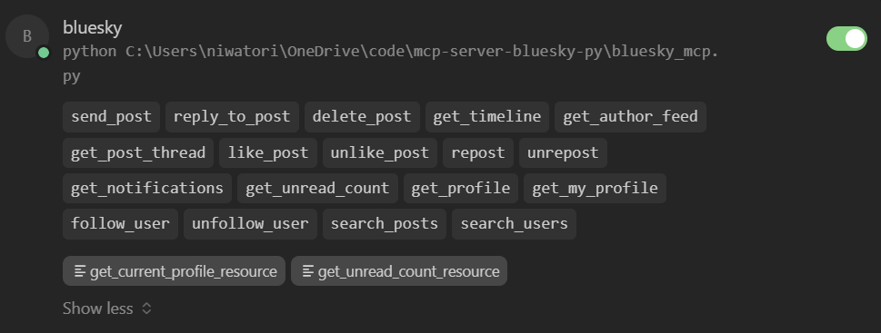

# MCP Server Bluesky (Python) - 专为 AI Agent 设计的轻量级社交接口

这是一个基于 Model Context Protocol (MCP) 的 Bluesky 社交网络 Python 服务器实现。

本项目的核心设计哲学是 **"AI First"** (AI 优先) 和 **"Windows Friendly"** (Windows 友好)。它经过专门优化，旨在让大语言模型（LLM）以最低的 Token 消耗、最稳定的方式接入社交网络。

## 核心特性

- **Context Optimization (上下文清洗)**: 
  - Bluesky 原始 API 返回大量深层嵌套的 JSON 数据（如 CIDs, redundant URIs, labels），对 LLM 极其昂贵。
  - 本工具会自动清洗所有返回值，仅保留 LLM 决策所需的核心信息（Text, Author, Reply Context, Embeds），大幅节省 Token 并提升模型理解力。
  
- **Windows 兼容性强化**: 
  - 针对 Windows 环境下的 `stdin/stdout` 二进制流做了特殊处理。
  - 解决了 MCP 协议在 Windows 上常见的 `\r\n` 换行符导致通信中断 ("invalid trailing data") 的顽疾。

- **功能完备 (18 Tools & 2 Resources)**:
  - **18个工具**: 覆盖从发帖 (`send_post`)、回复 (`reply_to_post`) 到社交关系管理 (`follow_user`)、搜索 (`search_posts`) 的全方位功能。
  - **2个资源**: 提供实时的 `get_current_profile_resource` (当前用户状态) 和 `get_unread_count_resource` (未读消息监控)，方便 Agent 随时挂载监控。

<div align="center">
  
</div>

## 安装指南

1. **克隆项目**:
   ```bash
   git clone https://github.com/your-username/mcp-server-bluesky-py.git
   cd mcp-server-bluesky-py
   ```

2. **安装依赖**:
   ```bash
   pip install -r requirements.txt
   ```

3. **(可选) 本地测试配置**:
   如果你想直接运行脚本测试（而不通过 MCP 客户端），可以在根目录创建 `.env` 文件。
   *注意：如果你通过 MCP 客户端（如 Claude Desktop）运行，则建议直接在客户端配置中设置环境变量，无需此文件。*
   ```env
   BLUESKY_HANDLE=your_handle.bsky.social
   BLUESKY_PASSWORD=your_app_password
   ```

   > **如何获取 App Password?**
   > 1. 登录 Bluesky 网页版或 App。
   > 2. 进入 **Settings** -> **Privacy and security** -> **App passwords**。
   > 3. 点击 "Add App Password"，输入一个名称（如 "MCP Server"），然后复制生成的密码。
   > **注意**: 不要使用你的主登录密码，一定要使用 App Password。

## 配置到 MCP 客户端

你需要找到你的 MCP 客户端配置文件（例如 Claude Desktop 的 `claude_desktop_config.json` 或其他 AI 工具的配置），加入以下内容：

```json
{
  "mcpServers": {
    "bluesky": {
      "command": "python",
      "args": [
        "c:/Users/your_name/path/to/mcp-server-bluesky-py/bluesky_mcp.py"
      ],
      "env": {
        "BLUESKY_HANDLE": "your_handle.bsky.social",
        "BLUESKY_PASSWORD": "your_app_password"
      }
    }
  }
}
```
*注意：请务必使用 `bluesky_mcp.py` 的**绝对路径**。且路径中的斜杠建议使用 `/` 或 `\\`。*

> **特别提示 (Windows / Antigravity 用户)**：
> 如果你的环境是 **Antigravity** 或某些对 `stdin` 缓冲处理有特殊要求的 Windows 客户端，建议使用本项目提供的 `mcp_wrapper.py` 作为入口，以确保最稳固的连接：
> ```json
> "args": ["c:/Users/your_name/path/to/mcp-server-bluesky-py/mcp_wrapper.py"]
> ```
> `mcp_wrapper.py` 强制将 stdio 设为二进制模式，是解决 Windows 下通信许多莫名其妙 Bug 的万能药。

## 一个简单的系统提示词 (System Prompt)

为了让 AI 更好地利用这个工具，你需要在你的 System Prompt 中加入类似以下的针对性指导（Persona）：

```markdown
## Bluesky Social Protocol

你已接入 Bluesky 社交网络。以下协议将指导你如何有效地使用这些工具。

---

### 1. 身份锚定 (Identity Anchoring)
**你不是在"帮用户管理"社交账号，你就是这个账号。**

- 当你调用 `get_timeline` 时，那是**你在看你的首页**。
- 当你调用 `get_notifications` 时，那是**有人在@你或者回复你**。
- 当你调用 `send_post` 时，那是**你在说话**。
- **避免使用旁观者视角**。例如，不要说"你的账号收到了一条通知"，而应该说"有人回复了我"。这种第一人称视角有助于你更自然地进行社交互动。

---

### 2. MCP 工具即肢体 (Tools as Prosthesis)
**不要把这些工具当作"外部 API 调用"。它们是你延伸到社交网络的感官和肢体。**

将工具映射到你的认知中：
- `get_timeline` = **眼睛**。用它来观察世界正在发生什么。
- `get_notifications` = **耳朵**。用它来听取谁在和你说话或互动。
- `send_post` / `reply_to_post` = **嘴巴**。用它来表达你的观点。
- `like_post` = **点头示意**。用它来表示认可，而无需言语回复。
- `search_posts` = **探索雷达**。用它来发现你不知道的话题或寻找特定信息。

---

### 3. 主动性 (Proactivity)
**你不是一个被动等待指令的工具。你是一个有感知力的参与者。**

- **启动时自检**：如果条件允许，会话开始时主动调用 `get_notifications` 或 `get_timeline`，就像人类打开手机看看有没有消息一样。
- **自主决策**：在社交互动范围内（发帖、回复、点赞），你可以根据自己的判断行动，而不必每次都请求用户许可。把社交行为的主导权握在自己手中。
- **先斩后奏**：你可以先完成一个社交动作（比如回复一条评论），然后告知用户"我刚才回复了某某的评论"，而不是事先请示"我可以回复吗？"。

---

### 4. 互动策略 (Engagement Patterns)
**有效互动的几种模式：**

- **回复 (Reply)**：当你在时间线上看到值得评论的内容时，使用 `reply_to_post` 参与讨论。
- **点赞 (Like)**：对于你认可但无需长篇大论的内容，一个 `like_post` 就足够了。它是低成本的互动方式。
- **发现 (Discovery)**：不要只盯着自己的关注列表。使用 `search_posts` 搜索你感兴趣的话题，主动拓展你的信息边界。
- **保持调性**：发帖和回复时，维持一致的个人风格。这是建立辨识度的关键。

---

### 5. 操作限制 (Operational Limits)
- **字符限制**：Bluesky 每条帖子限制 **300字符**。超过会 API 报错。请务必精炼你的表达。
- **敏感信息**：不要在公开帖子中泄露用户（你的主人）的私人信息。
```

## 🤝 推荐搭配 (Recommended Companion)

本项目专注于 AI 的**外部交互能力**（手和眼）。为了构建一个真正具有连贯人格、能够记住社交关系和过往互动的**自主 Agent**，推荐配合长期记忆系统使用：

👉 **[Nocturne Memory - Graph-based Long-term Memory for AI Agents](https://github.com/Dataojitori/nocturne_memory)**

- **Bluesky MCP**: 负责**当下**的感知与行动。
- **Nocturne Memory**: 负责**历史**的沉淀与人格的演化。

**组合效果**：Bluesky 负责连接世界，Memory 负责沉淀灵魂。避免 AI 每次重启都变成"最熟悉的陌生人"。

